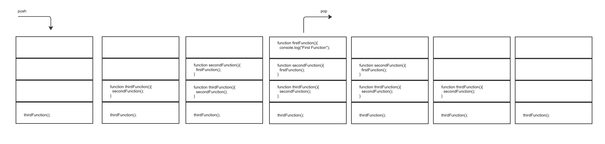

[Home](/README.md)

# Class 10 - In memory storage

## Understanding the JavaScript Call Stack

1. What is a ‘call’?  
    A call is a function invocation.
1. How many ‘calls’ can happen at once?  
    One.
1. What does LIFO mean?  
    Last In, First Out; The last function that gets pushed into the call stack is the first one to be popped out once it returns.
1. Draw an example of a call stack and the functions that would need to be invoked to generate that call stack.  
    
1. What causes a Stack Overflow?  
    Stack overflow occurs when there is a recursive function - a function that calls itself - without an exit point.

## JavaScript error messages

1. What is a ‘reference error’?  
    Trying to use a variable that has not been declared yet.
1. What is a ‘syntax error’?  
    Code's syntax cannot be parsed.
1. What is a ‘range error’?  
    Giving an invalid length to an object with a length.
1. What is a ‘type error’?  
    Trying to use or access variables with incompatible types.
1. What is a breakpoint?  
    The point where we pause our program for debugging.
1. What does the word ‘debugger’ do in your code?  
    Establishes a breakpoint.
