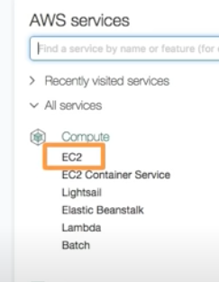

[Home](/README.md)

# Class 16 - AWS: Cloud Servers

## AWS EC2

1. What is an EC2 Instance?  
EC2 Instance is a virtual computer we can rent in the AWS Cloud.
1. Name 2 use cases for EC2.  
Web hosting, Data processing
1. Provide 1 reason to use ECS instead of a service such as Heroku, Digital Ocean, or Render.com.  
Easier to manage applications due to having access to other AWS services including database and storage.

## EC2 For Humans

1. Where can we find EC2 on the AWS Console?  
Under the compute section:  

1. Explain the general difference between T2 Micro and XL.  
XL Instance offers more power in the form of memory, CPU and network resources and is suitable for high-performance workloads, compared to T2 Micro instance which is designed for smaller applications and dev environments.

1. Explain a “Compute Cycle” to a non-technical friend.  
A compute cycle is the process or the collection of steps a computer goes through to perform a task or computation.

## Elastic Beanstalk

1. What is Elastic Beanstalk?  
Easy to use service that deploys, manages and scales web apps and services for the user.
1. Describe the relationship between EC2 and Elastic Beanstalk.  
Elastic Beanstalk provides the platform for deploying and managing applications on EC2 instances.
1. Name some benefits of using Elastic Beanstalk.

- Users can focus on building apps without spending too much time configuring and managing infrastructure
- Automatic scaling
- Access to other AWS services
